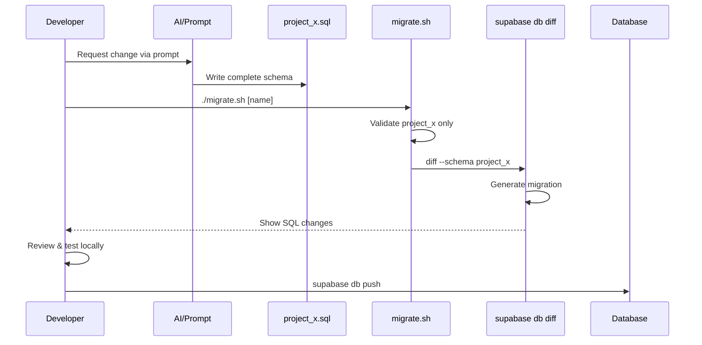

# 001: Use Declarative Schema Management with Schema-Isolated Migrations

## Status

**Proposed** | Date: 2025-08-31

## Context

- **Single developer** managing multiple projects - need maximum simplicity without coordination overhead
- **Cost constraint** requires multiple projects sharing one database instance
- **Imperative migrations** scatter schema state across hundreds of files, obscuring current structure
- **Project isolation** critical - changes to one project must not affect others
- **Simplicity priority** - willing to trade control for reduced complexity
- **State visibility** needed - must see complete schema without reconstructing from migrations

## Decision

We will use declarative schema management where developers define only desired state, letting the CLI generate migrations, with tooling enforcing isolation.

**Implementation Stack:**

```
[Developer] → [/migrate] → [Schema File] → [migrate.sh] → [CLI --schema] → [Database]
     ↑                                                                           ↓
     └─────────────────── Review & Commit ←────────────────────────────────────┘

```

**The Paradigm Shift:**

```sql
-- BEFORE (Imperative): Think about changes
ALTER TABLE invoices ADD COLUMN status text;
ALTER TABLE invoices DROP COLUMN temp_field;
CREATE INDEX idx_status ON invoices(status);

-- AFTER (Declarative): Define end state
CREATE TABLE project_a.invoices (
    id bigint primary key generated always as identity,
    customer text not null,
    amount decimal(10,2),
    status text,  -- Just describe what should exist
    created_at timestamptz default now()
);
CREATE INDEX project_a.idx_status ON invoices(status);

```

**Project Structure:**

```
project-a/
├── supabase/
│   ├── schemas/
│   │   └── project_a.sql    # Complete truth
│   └── migrations/
│       └── *.sql            # Generated only - THESE FILES ARE READ-ONLY
└── migrate.sh               # Enforces isolation

```

**Lifecycle Sequence:**



**Completion Criteria:**

- Each project uses dedicated PostgreSQL schema (project_a, project_b, etc.)
- Schema files contain complete desired state
- Migration script validates single-schema changes
- AI prompt ensures correct schema syntax
- Developers never edit migration files

**Tooling Roles:**

- `/migrate`: An AI Prompt that ensures complete, valid schema file generation
- **migrate.sh**: Enforces schema isolation via --schema flag
- **CLI**: Handles complex SQL generation and state comparison

## Consequences

### ✅ Positive

- **Radical simplicity** - describe what you want, not how to get there
- **Single source of truth** - entire schema visible in one file
- **Zero SQL migration writing** - CLI generates optimal transformations
- **Guaranteed isolation** - script prevents cross-project contamination
- **Minimal cognitive load** - no tracking migration sequences
- **Fast iteration** - change file, run script, deploy

### ❌ Negative

- **No migration control** - cannot optimize execution strategies
- **Tool dependency** - fully reliant on CLI diff accuracy
- **Review requirement** - must verify generated SQL
- **DDL only** - no data manipulation support
- **Forward only** - no built-in rollback mechanism

### ⚪ Neutral

- Both schema and migration files in version control
- Requires wrapper script for safety
- New mental model (states not transitions)

## Alternatives Considered

| Alternative | Rejection Reason |
| --- | --- |
| **Imperative Migrations** | State scattered across files, requires SQL expertise, violates simplicity |
| **Single Shared Schema** | No isolation, naming conflicts, coupled deployments |
| **Separate Databases** | Multiplies costs, defeats economic constraint |
| **Direct CLI Usage** | Easy to forget --schema flag, risk cross-contamination |
| **Mixed Declarative/Imperative** | Two mental models, increased complexity |

## References

Essential documentation for implementation:

- [Declarative Database Schemas](https://supabase.com/docs/guides/local-development/declarative-database-schemas) - Core concept and paradigm
- [CLI db diff Reference](https://supabase.com/docs/reference/cli/supabase-db-diff) - Schema flag usage
- [Local Development Overview](https://supabase.com/docs/guides/local-development/overview) - Development workflow